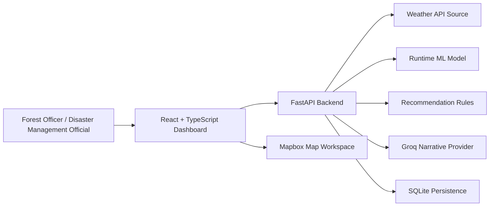

# FIREWATCH DSS

FIREWATCH DSS is a final-year prototype for weather-driven wildfire risk decision support in Turkiye. It lets a forest officer or disaster management official select a Turkish location, fetch live weather, run a runtime-compatible machine learning model, and review a relative wildfire risk assessment through a map-first dashboard.

The system is designed as decision support, not as fire detection, official emergency alerting, or a validated national fire-danger service.

## What It Does

- Interactive Mapbox dashboard centered on Turkiye.
- Search for Turkish locations by name or direct coordinates.
- Click any location on the map inside Turkiye to start the same assessment flow as search.
- Fetch current and forecast weather from Open-Meteo, with optional OpenWeather fallback.
- Generate risk assessments for `now`, `24h`, `48h`, and `72h` forecast windows.
- Produce a `low`, `medium`, `high`, or `critical` relative wildfire risk level.
- Show risk score, weather signals, model evidence, recommended action, and narrative briefing text.
- Store grouped prediction history records for previous on-demand assessments.
- Surface degraded states clearly when external integrations are unavailable.

## Important Model Scope

FIREWATCH DSS reports **Relative Wildfire Risk**: a comparison-oriented estimate of whether local weather conditions are favorable for wildfire ignition or rapid spread.

The deployed MVP model is trained from a Morocco wildfire proxy dataset using only features that can also be produced at runtime for Turkish locations. Rich training-only fields such as Morocco coordinates, station metadata, long historical aggregates, NDVI, SoilMoisture, and lagged location features are intentionally excluded unless a reliable Turkish runtime source is added later.

This means:

- The project demonstrates an honest end-to-end decision-support workflow.
- Results should be interpreted as prototype risk estimates.
- The model is not operationally validated for Turkiye.
- Risk levels are not official Turkish fire-danger classes.
- Map markers are predicted risk indicators, not confirmed active fires.

## Architecture



Primary runtime flow:

1. User searches or clicks a Turkish location.
2. Frontend sends an on-demand assessment request to the backend.
3. Backend fetches current and forecast weather.
4. Runtime feature builder normalizes weather inputs.
5. ML model produces a risk score.
6. Operational thresholds map the score to a risk level.
7. Recommendation rules select the approved action and monitoring radius.
8. Narrative provider generates briefing text, or the backend uses a deterministic fallback.
9. Result is displayed on the map and stored in prediction history.

## Repository Structure

- `frontend/` - React, TypeScript, Vite dashboard.
- `backend/` - FastAPI API, weather integrations, assessment workflow, alerts, and persistence.
- `ml/` - model training pipeline, selected model artifact, and metrics.
- `data/` - curated Turkish location index and supporting data.
- `docs/` - product, UI, architecture, ADR, and implementation documentation.
- `scripts/` - project helper scripts.

## Requirements

- Python 3.11 or newer recommended.
- Node.js 20 or newer recommended.
- A Mapbox public access token for the interactive map.
- Optional OpenWeather API key for weather fallback.
- Optional Groq API key for live narrative generation.

## Environment Setup

Copy the example environment file:

```bash
cp .env.example .env
```

On Windows PowerShell:

```powershell
Copy-Item .env.example .env
```

Configure these values in `.env`:

```text
MAPBOX_ACCESS_TOKEN=your_mapbox_public_token
OPENWEATHER_API_KEY=your_openweather_api_key
GROQ_API_KEY=replace_with_real_key_in_local_env_only
MODEL_ARTIFACT_PATH=ml/artifacts/model.joblib
DATABASE_URL=sqlite:///storage/firewatch.sqlite3
```

Notes:

- `MAPBOX_ACCESS_TOKEN` is required for the production map view.
- `OPENWEATHER_API_KEY` is optional because Open-Meteo is the default weather source.
- `GROQ_API_KEY` is optional because deterministic narrative fallback is available.
- Never commit real API keys.

## Run The Backend

From the repository root:

```bash
pip install -r backend/requirements.txt
uvicorn app.main:app --app-dir backend --reload
```

If running from inside `backend/` instead:

```bash
cd backend
pip install -r requirements.txt
uvicorn app.main:app --reload
```

Useful backend endpoints:

- `GET /health`
- `GET /api/status`
- `GET /api/locations/search?q=Ankara`
- `POST /api/assessments`
- `GET /api/monitoring/overview`
- `GET /api/alerts/active`
- `GET /api/history`

## Run The Frontend

In a second terminal:

```bash
cd frontend
npm install
npm run dev
```

The Vite dev server proxies `/api/*` requests to the FastAPI backend on `http://127.0.0.1:8000`.

Build for production:

```bash
cd frontend
npm run build
```

## Tests

Run backend tests from the repository root:

```bash
pytest -q
```

Windows PowerShell helper:

```powershell
./scripts/test_backend.ps1
```

Run frontend tests:

```bash
cd frontend
npm test -- --run
```

Run the frontend build/type check:

```bash
cd frontend
npm run build
```

## Demo Checklist

Use this flow when presenting the project:

1. Open the dashboard and confirm the system status is visible.
2. Search for a Turkish location, for example `Ankara`.
3. Select the result and show the left selected-location panel.
4. Click a different location directly on the map and show that it triggers the same assessment flow.
5. Open the full decision support panel.
6. Explain the risk score, risk level, forecast windows, weather signals, recommendation, and narrative.
7. Open prediction history and show the grouped assessment record.
8. Open settings/model status and explain external integration state, model evidence, and the transfer limitation.

## Academic Positioning

This project is strongest when presented as:

- A complete end-to-end AI decision-support prototype.
- A runtime-compatible ML deployment, not just notebook training.
- A map-first operational dashboard for wildfire monitoring workflows.
- A transparent system that labels live, fallback, degraded, cached, and demo data states.
- A responsibly scoped prototype that does not overclaim operational accuracy.

## Known Limitations

- The model uses a proxy training dataset and is not validated against Turkish wildfire history.
- Risk scores are relative prototype estimates, not official probabilities.
- The dashboard does not detect active fires from satellite imagery.
- The national monitoring view uses predefined monitoring locations and demo/context data where live national coverage is not implemented.
- The narrative layer explains structured assessment facts but does not make risk decisions.
- SQLite is used for MVP persistence; PostgreSQL would be more appropriate for multi-user production deployment.

## Documentation

Important supporting documents:

- `CONTEXT.md` - domain language and project scope.
- `docs/architecture/firewatch-architecture.md` - architecture baseline.
- `docs/architecture/reviewed-outcome-foundations.md` - future outcome review and validation strategy.
- `docs/adr/0001-runtime-compatible-model-features.md` - deployed model feature decision.
- `docs/adr/0002-sentinel-inspired-frontend-direction.md` - dashboard design direction.
- `docs/prd/frontend-implementation-prd.md` - frontend implementation requirements.
