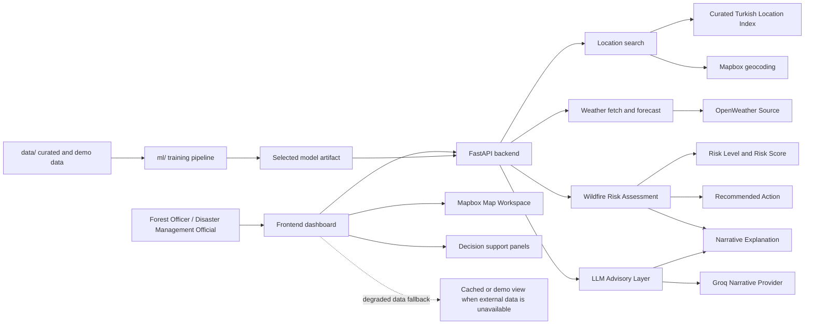

# FIREWATCH DSS

End-to-end wildfire risk prediction and decision support system integrating weather data, machine learning models, and geospatial analysis.

## Project Structure

- `frontend/`: React, TypeScript, Vite dashboard.
- `backend/`: FastAPI backend, integrations, assessment orchestration, persistence.
- `ml/`: model training, selected model artifacts, notebooks, and metrics.
- `data/`: raw, processed, demo, and curated location data.
- `docs/`: product, UI, architecture, and ADR documentation.
- `scripts/`: project helper scripts.

## Project Overview



This is the shortest end-to-end view of the MVP: a user selects a Turkish location, the backend fetches weather, the model produces a risk assessment, and the dashboard shows the result with a clear fallback when live data is unavailable.

Model behavior explanation notes:

- The assessment response now includes a phase-two `model_explanation` block based on runtime-feature perturbation against the deployed model.
- This explanation is explicitly labeled as model behavior and not proven wildfire causality.
- Because the model uses a proxy training dataset, explanation impacts should be read as directional support for monitoring decisions, not operational validation for Turkiye.

## Environment Configuration

Copy `.env.example` to `.env` in the repository root and set:

- `MAPBOX_ACCESS_TOKEN`
- `OPENWEATHER_API_KEY`
- `GROQ_API_KEY`
- `MODEL_ARTIFACT_PATH`
- `DATABASE_URL`

The backend loads `.env` automatically and exposes only safe configuration
state through `GET /api/status`.

## Backend (FastAPI)

```bash
cd backend
pip install -r requirements.txt
uvicorn app.main:app --reload
```

The frontend dev server proxies `/api/*` to `http://127.0.0.1:8000`,
so keep the backend running on port `8000` during local dashboard work.

Backend status surfaces:

- `GET /health`
- `GET /api/status`
- `GET /api/locations/search?q=<query>`

Location search supports:

- Curated Turkish place lookup (province/district/city/demo entries)
- Direct coordinates in `latitude, longitude` format (example: `39.9334, 32.8597`)

Run backend smoke tests:

```bash
pytest -q
```

The root `pytest.ini` keeps backend test discovery and imports working from
the repository root, so you do not need to `cd backend` first.
If you prefer a one-command wrapper on Windows PowerShell, run:

```powershell
./scripts/test_backend.ps1
```

## Frontend (React + Vite)

```bash
cd frontend
npm install
npm run dev
```

Run frontend smoke tests:

```bash
cd frontend
npm test -- --run
```
