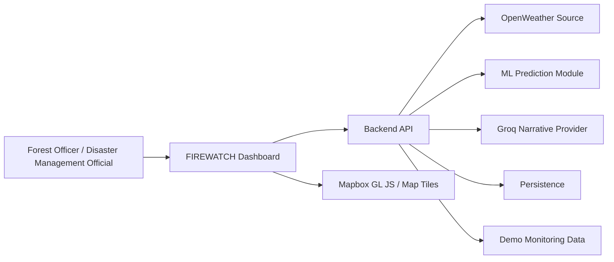
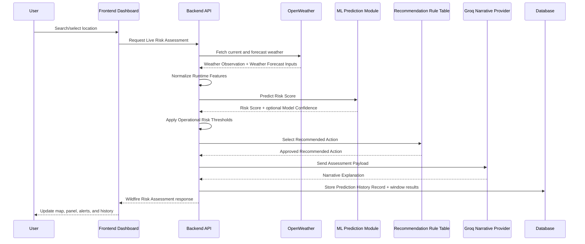

# FIREWATCH DSS Architecture

Status: grilled and updated MVP architecture baseline

This document records the grilled MVP architecture for FIREWATCH DSS based on the current domain glossary, dashboard UI direction, and resolved architecture decisions. It is the implementable baseline for the final-year project; hard-to-reverse trade-offs are captured separately as ADRs when needed.

## Sources

- `CONTEXT.md`
- `docs/ui/firewatch-dashboard.md`
- Current project scope: final-year MVP for weather-driven wildfire risk decision support in Turkiye

## Architectural Goal

FIREWATCH DSS should prove one end-to-end workflow:

1. A user selects or searches a Turkish location.
2. The system fetches current and forecast weather from OpenWeather.
3. A runtime-compatible ML model produces a Risk Score.
4. Operational Risk Thresholds map the Risk Score to a Risk Level.
5. A Recommendation Rule Table selects an approved Recommended Action.
6. Groq produces calm Operational Briefing Text from an Assessment Payload, with a deterministic fallback.
7. The result is displayed on a Mapbox Map Workspace and stored as one grouped Prediction History Record with per-window results.

## Proposed Top-Level Shape

Use a single repository and a single deployable application with clear internal boundaries:

- Frontend dashboard
- Backend API
- In-process ML prediction module behind a `PredictionService` interface
- Integration clients
- Persistence layer
- Demo monitoring data layer

This avoids microservice overhead while keeping each responsibility testable. The selected model artifact is loaded by the FastAPI backend process for the MVP; a separate prediction service is a future option only if deployment or scaling pressure justifies it.

## Recommended MVP Stack

Frontend:

- React
- TypeScript
- Mapbox GL JS
- Vite
- Client-side routing for dashboard screens

Frontend stack decision:

- Use Vite React with TypeScript for the MVP dashboard.
- Keep routing and screen composition in the browser for Monitoring Dashboard, Prediction History, and Model And Data Status.
- Keep server-side rendering, server actions, and Next.js-specific deployment patterns out of the MVP.
- Treat FastAPI as the only backend API surface; the frontend calls `/api/*` and never owns model-backed decision logic.

Backend:

- Python FastAPI
- Pydantic request/response models
- SQLAlchemy or a small repository layer for persistence

Backend stack decision:

- Use FastAPI for the MVP backend.
- Keep Python as the home for weather normalization, runtime feature building, model artifact loading, and assessment orchestration.
- Keep TypeScript in the frontend only, so the browser owns presentation while the Python backend owns model-backed decision support.
- Do not use a TypeScript backend for the MVP, because it would complicate in-process Python model serving.

Machine learning:

- Python scikit-learn pipeline
- Candidate model training for Random Forest, gradient boosting, XGBoost, and other suitable tabular ML algorithms
- In-process prediction inside the FastAPI backend for the MVP
- Runtime-compatible feature subset from the Morocco Wildfire Dataset
- Serialized model artifact with `joblib` or equivalent

Persistence:

- SQLite for MVP simplicity
- PostgreSQL as a future production upgrade if needed

Persistence decision:

- Use SQLite for the final-year MVP.
- Keep database access behind a small repository layer so persistence details do not leak into assessment, alert, or history logic.
- Use migrations or explicit schema scripts from the start, even if the first database is a local SQLite file.
- Treat PostgreSQL as a phase-two upgrade for multi-user production deployment, stronger concurrency, or hosted operations.

External services:

- Mapbox for satellite-style map rendering
- OpenWeather for current and forecast weather
- Groq for MVP narrative explanations

Configuration:

- `MAPBOX_ACCESS_TOKEN`
- `OPENWEATHER_API_KEY`
- `GROQ_API_KEY`

## System Context

## Primary Runtime Flow

If Groq is unavailable, the backend uses a deterministic template fallback. If OpenWeather is unavailable, the backend must not create an unlabelled Live Risk Assessment.

## Major Modules

### Frontend Dashboard

Responsibilities:

- Render the Sentinel-Inspired Interface.
- Own map interaction, search UI, layer toggles, side panels, bottom strip, and status display.
- Display Data Source Labels for live, demo, estimated, cached, unavailable, and fallback states.
- Never compute authoritative Risk Levels on the client.

Key subareas:

- Map workspace
- Search overlay
- Data layer sidebar
- Decision support panel
- Alert timeline and region strip
- Prediction history screen
- Model and data status screen

### Location Resolver

Responsibilities:

- Resolve user input into a Location Search Result.
- Prefer the Curated Turkish Location Index for reliable MVP search behavior.
- Support direct coordinates.
- Optionally call Mapbox geocoding for broader search.

Deep-module interface idea:

- Input: search text or coordinates
- Output: display name, latitude, longitude, administrative metadata, source label

### Weather Client

Responsibilities:

- Fetch Weather Observations and Weather Forecast Inputs from the OpenWeather Source.
- Normalize OpenWeather fields into canonical metric Prediction Inputs and display-only Weather Signals.
- Map Forecast Windows to deterministic OpenWeather records.
- Report Degraded Data Status when OpenWeather is unavailable.
- Support cached weather only when clearly labeled as cached.

Deep-module interface idea:

- Input: location, forecast windows
- Output: current and forecast weather records, canonical metric Prediction Input candidates, display Weather Signals, unit metadata, source labels, and freshness metadata

Forecast Window mapping:

- `now` uses the OpenWeather current weather response.
- `24h`, `48h`, and `72h` use the OpenWeather 5 day / 3 hour forecast response.
- For each forecast window, choose the forecast record nearest to the assessment request time plus the requested offset.
- Store and return the matched OpenWeather timestamp for every assessment window.
- Do not describe forecast-window assessment as fire-spread modeling or time-series wildfire simulation; it is the same runtime-compatible model applied to forecast weather snapshots.

### Risk Assessment Service

Responsibilities:

- Orchestrate location, weather, model prediction, thresholds, priority, recommendation, narrative, alerts, and persistence.
- Produce a complete Wildfire Risk Assessment response.
- Keep the backend as the source of truth for Risk Score, Risk Level, Recommended Action, Priority Rank, and Monitoring Radius.

Deep-module interface idea:

- Input: Location Search Result plus requested Forecast Windows
- Output: complete assessment DTO suitable for the dashboard

### ML Prediction Module

Responsibilities:

- Load the trained model artifact.
- Serve predictions in-process inside the FastAPI backend for the MVP.
- Hide model loading and prediction behind a small `PredictionService` interface.
- Enforce the deployed runtime feature contract.
- Generate Risk Score and optional Model Confidence.
- Reject or clearly handle missing Runtime Features.

Training rules:

- Train the deployed MVP model on the Morocco Wildfire Dataset using only features the backend can produce at assessment time from the selected Turkish location, Forecast Window, calendar date, and OpenWeather response.
- Confirm the source dataset units during training and convert training features into the canonical metric unit schema before model fitting.
- Exclude proxy dataset columns such as raw Morocco coordinates, station metadata, lagged coordinates, NDVI, SoilMoisture, long historical aggregates, and 15-day lag features unless a reliable Turkish runtime source is added for that feature.
- Document every excluded dataset column category as a Training-Only Feature, even if it improves held-out proxy validation metrics.
- Validate on held-out proxy data, while documenting the Transfer Limitation for Turkiye.

Model training and selection:

- Train and compare multiple candidate algorithms, such as Random Forest, gradient boosting, XGBoost, logistic regression, or other suitable tabular classifiers.
- Select one deployed model artifact for the MVP assessment API.
- Record the chosen algorithm, feature schema, evaluation metrics, training date, dataset version, and model version.
- Prefer the candidate that gives the best responsible decision-support behavior under the runtime feature contract, not necessarily the candidate with the highest proxy metric after using unavailable features.
- Use a fixed train/validation/test protocol for all candidate models so comparisons are reproducible.
- Do not select the deployed model using accuracy alone.
- Prioritize recall for the wildfire class and useful risk ranking, while checking precision so the dashboard does not become noisy with excessive false positives.
- Compare candidates with a confusion matrix, wildfire-class precision, wildfire-class recall, F1 score, ROC-AUC or PR-AUC, and calibration or score-distribution review where feasible.
- Choose the simplest candidate that meets the acceptance target and produces stable Risk Scores under the deployed runtime feature contract.
- Produce MVP model evidence that includes the runtime feature schema, candidate models tested, selected model, validation metrics, confusion matrix, threshold version, dataset source, and Transfer Limitation note.

Runtime feature contract:

- The model artifact must expose its ordered feature schema.
- The model artifact must expose the unit for each feature in the schema.
- The backend must build that exact schema before prediction.
- The backend must convert OpenWeather values into the model artifact's unit schema before prediction.
- A feature may enter the deployed model only when it can be generated for a Turkish assessment request without manual data patching.
- Forecast assessments may use forecast weather values for the requested Forecast Window, but must not silently reuse unavailable historical features.
- The selected Turkish location may be used for weather lookup, map display, assessment labeling, and administrative filtering.
- Raw latitude, raw longitude, station latitude, station longitude, and lagged coordinate fields are not deployed MVP Prediction Inputs.
- Location-derived model features may be added later only when they represent Turkiye-valid Runtime Features, such as forest cover, elevation, coastal distance, or vegetation dryness from documented sources.

MVP OpenWeather feature split:

- Deployed MVP Prediction Inputs: temperature, minimum temperature, maximum temperature, precipitation or rain amount, wind speed, and wind gust.
- Display-only Weather Signals for MVP: humidity, pressure, cloud cover, visibility, weather condition code or description, and probability of precipitation.
- Display-only Weather Signals may be used in the dashboard, narrative payload, and officer-facing briefing, but must not be described as model inputs unless they are added consistently to both training and runtime feature schemas.

Canonical unit schema:

- Temperature features: Celsius.
- Precipitation or rain amount: millimeters.
- Wind speed and wind gust: meters per second.
- Display-only humidity: percent.
- Display-only pressure: hPa.
- Display-only cloud cover: percent.
- Display-only visibility: meters.
- Do not mix Fahrenheit, Kelvin, imperial wind speed, or undocumented source units in the deployed feature vector.

### Risk Classification Module

Responsibilities:

- Map Risk Score to Risk Level using Operational Risk Thresholds.
- Keep thresholds configurable, documented, and tied to the deployed model version.
- Provide deterministic behavior for low, medium, high, and critical categories.
- Select numeric thresholds after model training by reviewing validation results, score distribution, and the confusion matrix.
- Tune high and critical thresholds to favor wildfire-class recall while keeping false positives usable for dashboard prioritization.
- Allow placeholder thresholds only for demo data or early UI integration, and label them as demo/config defaults.
- Never present thresholded Risk Levels as official Turkiye fire-danger classes or validated fire probabilities.

### Recommendation Engine

Responsibilities:

- Use the Recommendation Rule Table to select an approved Recommended Action, Monitoring Radius, and Risk Alert expiry from the Risk Level.
- Never delegate recommendation creation to Groq.
- Provide deterministic fallback text.

MVP Recommendation Rule Table:

| Risk Level | Recommended Action | Monitoring Radius | Risk Alert |
| --- | --- | --- | --- |
| low | Routine monitoring | 5 km | none |
| medium | Increase weather review | 10 km | none |
| high | Prioritize local inspection | 20 km | create alert, expires in 24h |
| critical | Immediate supervisor review | 30 km | create alert, expires in 12h |

The rule table must be versioned and stored with each Assessment Window Result. The wording may be refined for the UI, but Groq must not create actions outside this table.

### Narrative Service

Responsibilities:

- Build the Assessment Payload.
- Call the Groq Narrative Provider.
- Enforce grounded Operational Briefing Text.
- Fall back to deterministic template text when Groq is unavailable, rate-limited, or missing a key.

### Monitoring Overview Provider

Responsibilities:

- Produce the default Turkiye national monitoring overview.
- Use predefined Monitoring Locations populated by Demo Monitoring Data for the MVP.
- Label demo/simulated overview data compactly.
- Avoid implying continuous nationwide live coverage.
- Keep national overview hotspots, heat zones, and regional summaries separate from selected-location Live Risk Assessments.
- Use live OpenWeather calls only when the user searches for or selects a specific location, unless a later implementation explicitly adds scheduled live monitoring for predefined locations.

### Alert Service

Responsibilities:

- Create persistent Risk Alerts only from high or critical live selected-location Wildfire Risk Assessments.
- Treat demo overview high/critical hotspots as visual demo items, not persistent Active Risk Alerts.
- Track Active Risk Alerts until expiration, supersession, or review/closure.
- Use the Recommendation Rule Table to set alert expiration: 24h for high and 12h for critical in the MVP.
- Avoid official emergency-alert language.

### Persistence Layer

Responsibilities:

- Store Prediction History Records.
- Store generated Risk Alerts.
- Store data source metadata and model version references.
- Keep room for future Reviewed Outcome Entries and Prediction Outcome Comparisons without implementing that workflow in the MVP.
- Hide SQLite-specific details behind repository functions or classes.
- Keep table design compatible with a later PostgreSQL migration where practical.

## Proposed API Surface

### `GET /api/status`

Returns service and data status:

- OpenWeather availability
- Groq availability
- model status and version
- dataset source
- last training date
- runtime feature schema summary
- runtime feature unit schema
- candidate models tested
- selected model algorithm
- validation metrics and confusion matrix
- Operational Risk Threshold version
- Transfer Limitation note
- Mapbox configuration state if safe to expose

### `GET /api/locations/search?q=...`

Returns Location Search Results from:

- Curated Turkish Location Index
- direct coordinate parsing
- optional Mapbox geocoding

### `POST /api/assessments`

Creates a Live Risk Assessment or clearly labeled degraded/fallback response.

Request includes:

- location identifier or coordinates
- requested Forecast Windows
- demo role selection if needed for display emphasis

Response includes:

- location
- forecast assessments
- matched weather timestamp for each Forecast Window
- assessment source state: live or cached
- selected/current Risk Level
- Risk Score
- Operational Risk Threshold version
- optional Model Confidence
- Weather Signals
- Risk Trend
- Priority Rank
- Monitoring Radius
- Recommended Action
- Recommendation Rule Table version
- Risk Alert expiry, if created
- Narrative Explanation
- Data Source Labels
- created Risk Alert if applicable

### `GET /api/monitoring/overview`

Returns the default Turkiye monitoring overview:

- Monitoring Locations
- Predicted Risk Hotspots
- heat-zone data where available
- top priority regions
- active alert counts
- Data Source Labels

For the MVP, this endpoint returns curated Monitoring Locations with clearly labeled Demo Monitoring Data. It must not imply continuous live national coverage.

Demo overview hotspots may be visually high or critical, but they must not create persistent Active Risk Alerts.

### `GET /api/alerts/active`

Returns current Active Risk Alerts.

### `GET /api/history`

Returns grouped Prediction History Records with filters:

- region
- date range
- Risk Level across any Forecast Window result
- alert status

### Phase-Two API Candidates

These endpoints are excluded from MVP implementation.

- `POST /api/outcomes`
- `GET /api/outcomes`
- `POST /api/prediction-comparisons`
- `GET /api/model-evaluation`
- `POST /api/model-tuning-datasets`

## Data Model Draft

### Prediction History Record

Stores one parent assessment request:

- id
- location name
- latitude
- longitude
- administrative area
- assessment timestamp
- requested Forecast Windows
- demo role selection, if provided
- assessment source state
- model version
- threshold version
- dataset source note
- grouped summary

### Assessment Window Result

Stores one result for each Forecast Window in a Prediction History Record:

- id
- Prediction History Record id
- Forecast Window
- matched weather timestamp
- weather inputs
- Runtime Feature vector
- Runtime Feature unit schema version
- Risk Score
- Risk Level
- Operational Risk Threshold version
- Model Confidence, if available
- Risk Trend
- Priority Rank
- Monitoring Radius
- Recommended Action
- Recommendation Rule Table version
- Narrative Explanation
- Data Source Labels
- alert id, if created

### Risk Alert

Stores:

- id
- linked Prediction History Record
- Risk Level
- status: active, expired, superseded, reviewed, closed
- created timestamp
- expiration timestamp
- Recommendation Rule Table version
- selected location
- summary

### Monitoring Location

Stores:

- id
- display name
- latitude
- longitude
- administrative metadata
- monitoring category
- demo/live source state

### Reviewed Outcome Entry

Phase two. Excluded from MVP implementation unless the project later adds a reliable observed-fire source or reviewed manual outcome workflow.

Stores:

- id
- reported location
- reported time
- source type
- review status
- reviewer note
- wildfire occurrence flag

### Prediction Outcome Comparison

Phase two. Excluded from MVP implementation because it requires reviewed outcomes and an explicit Outcome Matching Window.

Stores:

- id
- Prediction History Record id
- Reviewed Outcome Entry id
- Outcome Matching Window
- match result
- evaluation label

## Data Provenance Rules

Every displayed major data element should carry a Data Source Label:

- Live
- Demo
- Estimated
- Cached
- Unavailable
- Fallback

The frontend should not hide provenance in tooltips only. Compact labels should be visible in panels, layer rows, and status areas.

The default national overview uses Demo Monitoring Data for curated Monitoring Locations in the MVP. A searched or selected location creates a Live Risk Assessment only when current or forecast weather is fetched from the OpenWeather Source.

Persistent Risk Alerts are created only from live selected-location assessments, not from Demo Monitoring Data.

During Degraded Data Status, the backend may return a Cached Assessment View only when cached weather exists for the same location and Forecast Window. The response must include the original weather timestamp and a `Cached` Data Source Label, and it must not be stored as a new Live Risk Assessment.

## Failure Modes

OpenWeather missing key or outage:

- Mark Weather API as degraded.
- Block new Live Risk Assessment creation.
- Return a Cached Assessment View only when matching cached weather exists for the same location and Forecast Window.
- Include the original weather timestamp and `Cached` Data Source Label.
- If no matching cached weather exists, return degraded status with no assessment result.
- Do not create a new live Prediction History Record from cached weather.
- Allow demo data only for the labeled national overview, not as a substitute selected-location live assessment.

Groq missing key, rate limit, or outage:

- Use deterministic template Operational Briefing Text.
- Mark narrative source as fallback.

Mapbox missing key:

- Show a clear map configuration error or fallback placeholder.
- Keep non-map status and history screens available where possible.

Model artifact missing or incompatible:

- Mark model as unavailable.
- Disable prediction creation.
- Keep demo overview visible only if labeled as demo.

Prediction service failure:

- Treat in-process prediction errors as model unavailable for the affected request.
- Return a clear degraded model status instead of fabricating a Risk Score.
- Keep the `PredictionService` boundary small enough that a future separate prediction service can reuse the same request and response contract.

Database unavailable:

- Assessments may be blocked or run in non-persistent demo mode only if clearly labeled.
- SQLite file or schema errors should surface as degraded persistence status, not as successful stored history.

## Security And Configuration

- External Service Keys must come from environment variables.
- API keys must not be committed.
- Backend should call OpenWeather and Groq so secrets are not exposed to the browser.
- Mapbox public token may be exposed to the frontend if restricted appropriately.
- MVP can use a simple, non-authenticated role selector for Forest Officer and Disaster Management Official.
- Demo role selection may change wording, ordering, or display emphasis, but must not grant or restrict access.
- Real authentication, authorization, user accounts, and role-based access control are phase two unless required by the final-year rubric.

## Testing Strategy

Unit tests:

- Runtime feature normalization.
- Runtime feature contract enforcement.
- Runtime feature unit conversion into canonical metric units.
- OpenWeather field split between Prediction Inputs and display-only Weather Signals.
- Forecast Window to OpenWeather record mapping.
- Risk Score to Risk Level thresholds.
- Threshold version selection for the deployed model.
- Recommendation Rule Table.
- Priority Score and Priority Rank.
- Monitoring Radius mapping.
- Risk Alert expiry mapping.
- Assessment Payload builder.
- Groq fallback template.
- Location search parsing.

Integration tests:

- Assessment API with mocked OpenWeather, model, Groq, and persistence.
- OpenWeather degraded state.
- OpenWeather outage blocks new live assessment when no matching cached weather exists.
- Cached Assessment View includes original weather timestamp and `Cached` label.
- Groq fallback behavior.
- History record creation.
- Grouped Prediction History Record creation with one Assessment Window Result per requested Forecast Window.
- Active Risk Alert creation only for high and critical live selected-location assessments.
- Recommendation Rule Table version is stored with window results and generated alerts.

Frontend tests:

- Search flow updates decision panel.
- Data Source Labels render correctly.
- Layer toggles do not imply model input status.
- Display-only Weather Signals do not appear as model-input drivers.
- Demo role selection changes presentation emphasis without hiding core assessment data.
- Groq fallback text is displayed when narrative provider is unavailable.

Model tests:

- Training pipeline uses only Runtime Features for the deployed model.
- Model artifact exposes expected feature schema.
- Model artifact exposes expected feature unit schema.
- Training-Only Features are excluded from the deployed artifact.
- Raw coordinate and station-coordinate columns are excluded from the deployed artifact.
- Candidate model comparison produces a single selected model artifact with recorded metrics.
- Candidate model comparison does not select by accuracy alone.
- Selected threshold configuration is recorded with the deployed model version.
- MVP model evidence includes feature schema, candidate comparison, selected model, validation metrics, confusion matrix, threshold version, dataset source, and Transfer Limitation note.
- Training and runtime feature units match the deployed model artifact schema.
- Prediction response shape is stable.

## MVP Build Order

1. Project scaffold and configuration.
2. Runtime feature contract and Training-Only Feature exclusions.
3. Curated Turkish Location Index.
4. OpenWeather client and weather normalization.
5. ML training pipeline using runtime-compatible features.
6. Prediction module and thresholds.
7. Recommendation Rule Table.
8. Backend assessment API.
9. Prediction history persistence.
10. Groq narrative service with template fallback.
11. Mapbox dashboard shell.
12. Search-to-assessment dashboard flow.
13. Curated Monitoring Locations with demo national overview.
14. Active Risk Alerts.
15. Model and data status screen with MVP model evidence.
16. Prediction history screen.

## MVP Out Of Scope

- Real-time fire detection.
- Satellite image processing.
- ESA Sentinel data processing.
- Drone monitoring.
- Physical sensor deployment.
- Automated emergency dispatch.
- Public citizen mobile app.
- Guaranteed operational accuracy across Turkiye.
- Fire-spread simulation.
- Evacuation radius or burn-area prediction.
- Live automatic model retraining.
- Prediction Outcome Comparison implementation.
- Reviewed Outcome Entry workflow.
- Model Tuning Dataset generation.
- Full 3D globe mode.
- SHAP model explanation unless core workflow is already solid.

## Phase-Two Candidates

- SHAP-style Model Explanation.
- Prediction Outcome Comparison UI.
- Reviewed Outcome Entries.
- Offline Model Tuning Dataset generation.
- PostgreSQL migration.
- Real authentication and role-based access control.
- Response stations and water source datasets.
- Historical fire-area layer.
- Vegetation dryness and soil moisture sources.
- More advanced heat-zone generation.
- Optional Mapbox globe mode.

## Decisions To Grill Next

- Core MVP architecture decisions resolved; remaining questions can be handled during implementation.
