# FIREWATCH DSS - Türkçe Sunum

Bu dosya slayt gibi hazırlanmıştır. Her `---` yeni slayt anlamına gelir. Metinleri PowerPoint, Google Slides veya Canva'ya kolayca taşıyabilirsin. Mermaid diagramlarını GitHub, VS Code preview veya Mermaid destekleyen araçlarda görsel olarak açabilirsin.

Dil seviyesi özellikle basit tutuldu. Sunumda uzun teknik cümleler yerine kısa ve net cümleler kullan.

---

## 1. Başlık

# FIREWATCH DSS

## Türkiye için hava verisine dayalı orman yangını risk karar destek sistemi

**Kısa tanım:**

FIREWATCH DSS, seçilen bir Türkiye konumu için canlı hava verisini alır, makine öğrenmesi modeli ile göreli yangın riskini hesaplar ve görevliye karar desteği verir.

**Konuşma notu:**

> Merhaba. Bugün FIREWATCH DSS projemi anlatacağım. Bu proje aktif yangını tespit etmez. Amacı, hava koşullarına bakarak orman yangını için riskli yerleri erken görmek ve görevliye karar desteği vermektir.

---

## 2. Proje Ne Yapıyor?

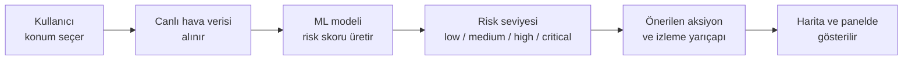

**Ana fikir:**

- Kullanıcı Türkiye'de bir konum seçer.
- Sistem canlı hava ve tahmin verisi alır.
- Model yangın için uygun hava koşullarını değerlendirir.
- Sonuç harita, panel, geçmiş kayıt ve uyarı olarak gösterilir.

**Konuşma notu:**

> Projenin akışı basit. Önce konum seçiyorum. Sonra backend hava verisini alıyor. Model risk skorunu hesaplıyor. Bu skor dört seviyeye çevriliyor. En sonunda sistem kullanıcıya ne yapması gerektiğini gösteriyor.

---

## 3. Bu Proje Ne Değildir?

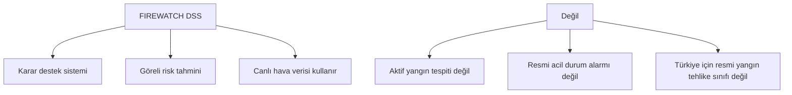

**Önemli sınır:**

Bu proje **relative wildfire risk** verir. Yani "bu hava koşullarında risk daha düşük mü, daha yüksek mi?" sorusuna cevap verir.

**Konuşma notu:**

> Burada çok önemli bir sınır var. Sistem yangın var demiyor. Sistem, hava koşulları yangın çıkması veya hızlı yayılması için ne kadar uygun, bunu söylüyor. Bu yüzden sonucu resmi olasılık gibi değil, prototip risk göstergesi gibi okumak gerekir.

---

## 4. Kullanıcılar

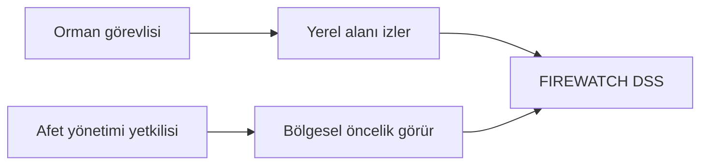

**İki ana kullanıcı:**

- Orman görevlisi: yerel risk ve önerilen aksiyon.
- Afet yönetimi yetkilisi: bölgesel öncelik ve izleme.

**Konuşma notu:**

> Birinci kullanıcı orman görevlisi. Örneğin Ankara veya Antalya'da belirli bir alanı kontrol edebilir. İkinci kullanıcı afet yönetimi tarafıdır. Onlar daha çok bölgesel öncelikleri görmek ister.

---

## 5. Genel Mimari

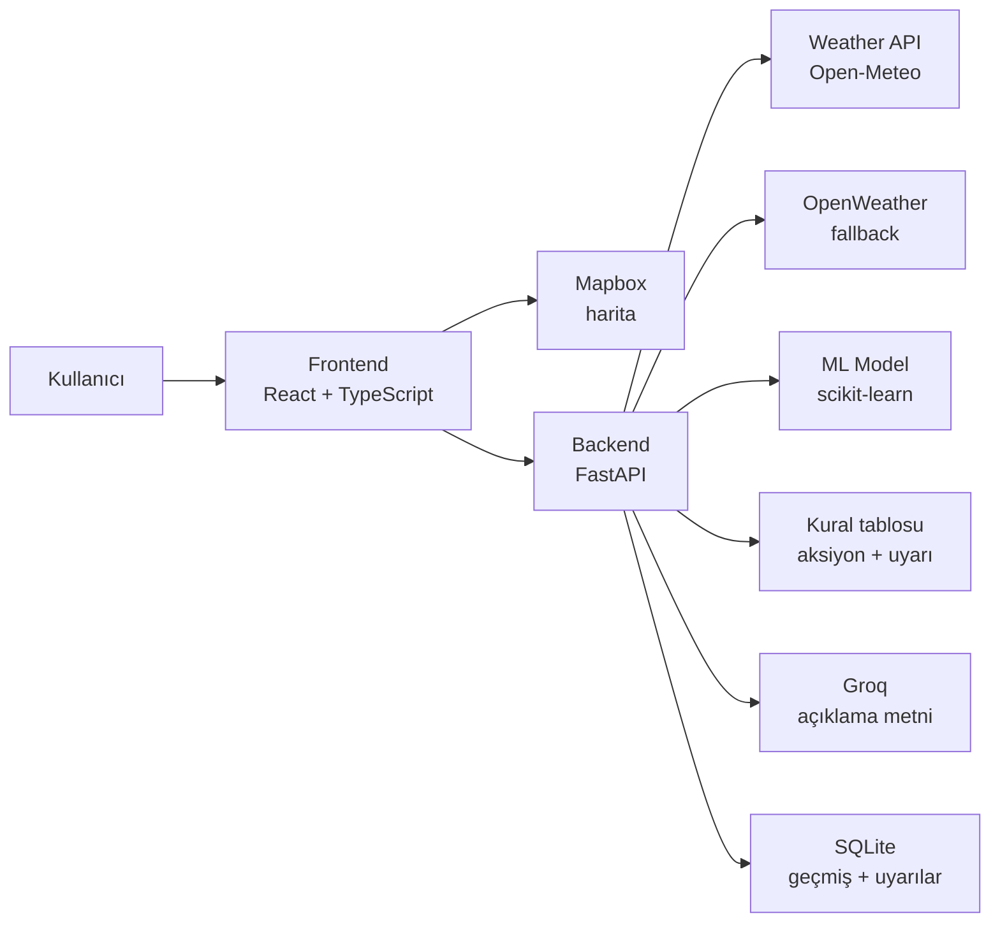

**Tek cümle:**

Frontend sadece gösterir ve kullanıcı etkileşimini yönetir. Backend ise risk kararının ana kaynağıdır.

**Konuşma notu:**

> Mimariyi üç ana parçaya ayırıyorum. Frontend harita ve panelleri gösteriyor. Backend hava verisini, modeli, kuralları ve veritabanını yönetiyor. Dış servisler ise Mapbox, Open-Meteo, OpenWeather ve Groq.

---

## 6. Canlı Değerlendirme Akışı

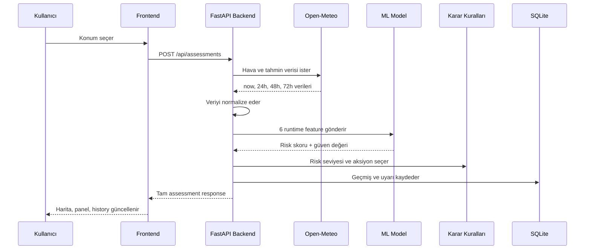

**Konuşma notu:**

> Canlı demoda göstereceğim işlem bu. Arama veya harita tıklaması aynı API akışını başlatıyor. Backend önce hava verisini alıyor, sonra model için doğru feature formatına çeviriyor. Sonra model skoru üretiyor ve sistem bunu kullanıcıya anlaşılır karar desteği olarak gösteriyor.

---

## 7. Frontend Nasıl Çalışıyor?

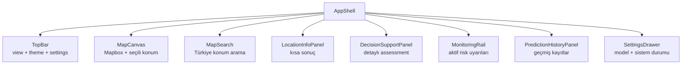

**Frontend görevi:**

- Harita merkezli dashboard.
- Konum arama ve haritadan konum seçme.
- Risk paneli, uyarılar, geçmiş ve sistem durumu.
- Dark/light tema.
- Model algoritması seçme desteği.

**Konuşma notu:**

> Frontend tarafında amaç, teknik sonucu görevlinin hızlı anlayacağı şekilde göstermektir. Risk kararı frontend'de hesaplanmıyor. Frontend backend'den gelen sonucu harita, panel ve geçmiş olarak gösteriyor.

---

## 8. Backend Nasıl Çalışıyor?

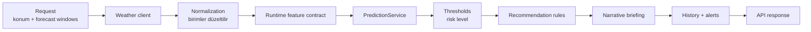

**Backend sorumlulukları:**

- Hava verisi almak.
- Birimleri standart hale getirmek.
- Model girişlerini doğrulamak.
- Risk seviyesini ve öneriyi üretmek.
- Uyarı ve geçmiş kayıtlarını tutmak.
- Servis bozulursa bunu açıkça göstermek.

**Konuşma notu:**

> Backend benim sistemde en kritik yer. Çünkü güvenilir karar burada üretiliyor. Eğer hava servisi çalışmazsa backend sahte sonuç üretmiyor. Durumu degraded olarak gösteriyor.

---

## 9. Hava Verisi ve Forecast Window

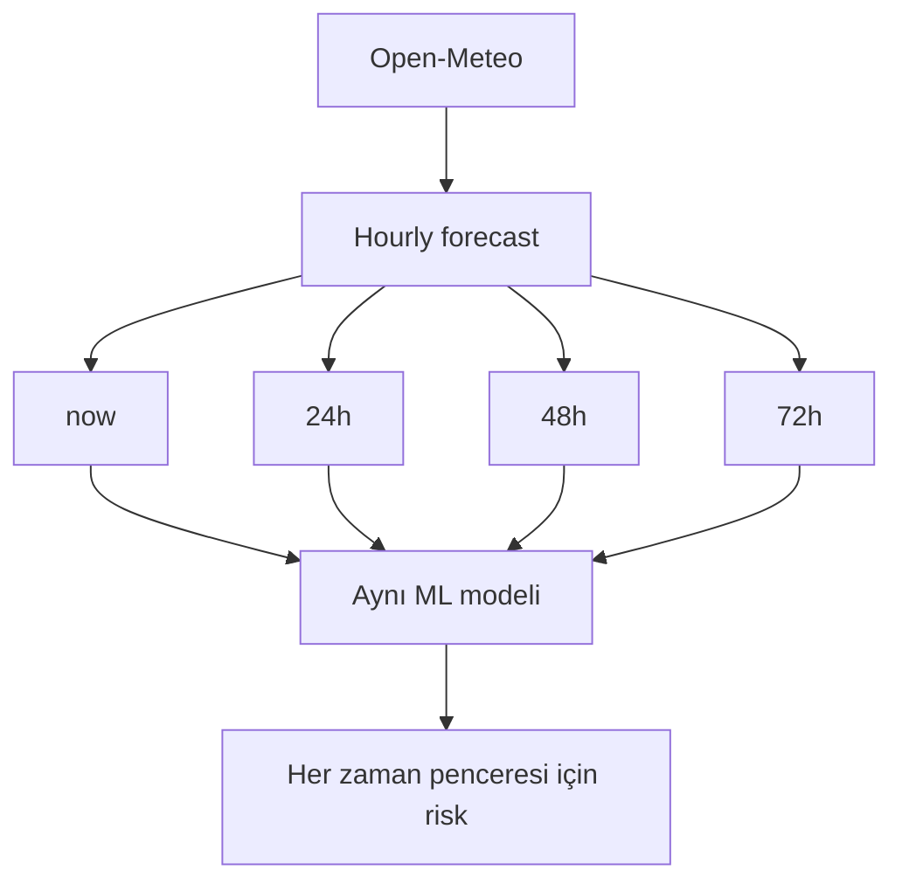

**Kullanılan kaynak:**

- Varsayılan: Open-Meteo.
- Fallback: OpenWeather, API key varsa.
- Hava kaynakları yangın olayı kaynağı değildir.

**Konuşma notu:**

> Sistem sadece şimdiki hava için değil, 24, 48 ve 72 saatlik tahmin pencereleri için de risk üretir. Bu bir yangın yayılma simülasyonu değildir. Aynı model, farklı forecast hava değerleri ile tekrar çalıştırılır.

---

## 10. Model Feature Contract

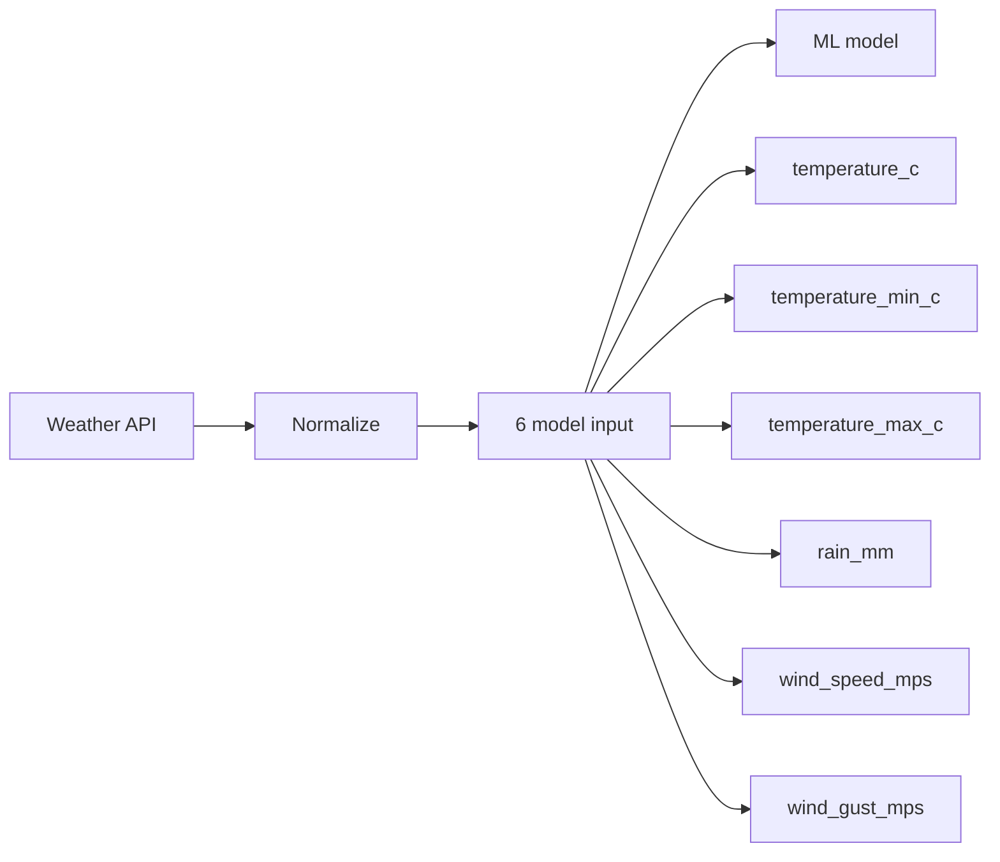

| Feature | Birim | Neden kullanılıyor? |
| --- | --- | --- |
| temperature_c | C | Sıcaklık riski etkiler |
| temperature_min_c | C | Günlük düşük sıcaklık |
| temperature_max_c | C | Günlük yüksek sıcaklık |
| rain_mm | mm | Yağış riski düşürebilir |
| wind_speed_mps | m/s | Rüzgar yayılmayı etkiler |
| wind_gust_mps | m/s | Ani rüzgar riski artırabilir |

**Konuşma notu:**

> Model sadece runtime'da gerçekten üretebildiğim 6 feature kullanıyor. Bu benim için önemli bir mühendislik kararıydı. Eğitimde daha fazla kolon vardı ama Türkiye için canlı olarak güvenilir üretemediğim kolonları modele koymadım.

---

## 11. ML Eğitim Süreci

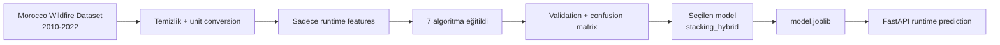

**Dataset:**

- Morocco Wildfire Dataset, 2010-2022.
- Türkiye verisi olmadığı için proxy dataset kullanıldı.
- Sonuçlar Türkiye için resmi doğruluk değildir.

**Konuşma notu:**

> Türkiye için açık ve yeterli etiketli yangın veri seti bulamadığım için Fas veri setini proxy olarak kullandım. Ama modeli direkt notebook'ta bırakmadım. Backend içinde çalışan runtime model artifact olarak deploy ettim.

---

## 12. Kaç Algoritma Kullandım?

**Toplam 7 algoritma / model adayı test edildi:**

| Algoritma | Rol |
| --- | --- |
| Logistic Regression | Basit baseline |
| Random Forest | Ağaç tabanlı güçlü model |
| Extra Trees | Daha rastgele ağaç ensemble |
| Gradient Boosting | Boosting tabanlı model |
| XGBoost | Güçlü boosting adayı |
| Soft Voting Hybrid | Birden çok modelin oylaması |
| Stacking Hybrid | Seçilen serving model |

**Konuşma notu:**

> Sadece tek model denemedim. Yedi farklı algoritma veya ensemble yaklaşımı test ettim. Son sistemde seçilen model stacking hybrid. Ayrıca settings panelinden model algoritması seçimi destekleniyor.

---

## 13. Model Performansı

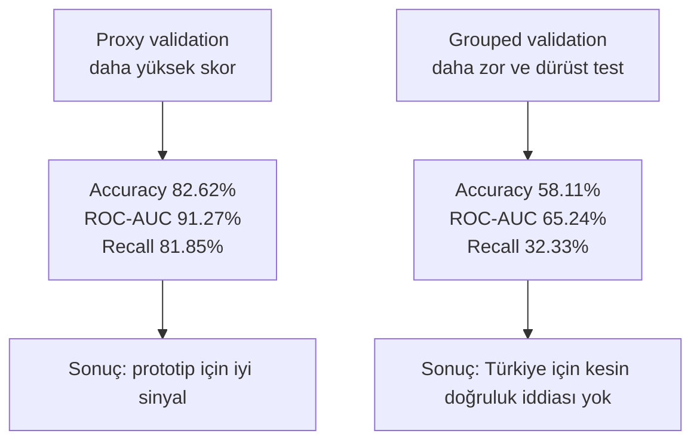

**Seçilen model: `stacking_hybrid`**

| Metrik | Normal proxy validation | Grouped validation |
| --- | ---: | ---: |
| Accuracy | 82.62% | 58.11% |
| ROC-AUC | 91.27% | 65.24% |
| Wildfire precision | 83.06% | 66.79% |
| Wildfire recall | 81.85% | 32.33% |
| Wildfire F1 | 82.45% | 43.57% |

**Konuşma notu:**

> Normal validation sonucunda model iyi görünüyor. Ama daha zor grouped validation sonucunda performans düşüyor. Ben bunu gizlemiyorum, çünkü proje akademik olarak dürüst olmalı. Bu sistem Türkiye için resmi model değildir; doğru kullanım şekli prototip ve göreli risk karar desteğidir.

---

## 14. Neden Daha Yüksek Performans Alamadım?

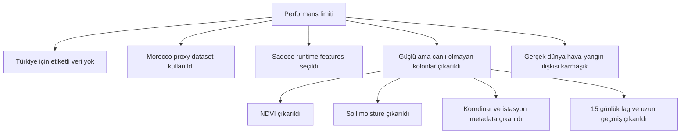

**Basit açıklama:**

Modeli daha yüksek göstermek mümkündü, ama bu doğru olmazdı. Çünkü bazı güçlü kolonlar canlı Türkiye kullanımında yoktu.

**Konuşma notu:**

> Daha yüksek skor almak için eğitimdeki bütün kolonları kullanabilirdim. Ama o zaman canlı Türkiye konumu için aynı veriyi üretemezdim. Bu yüzden NDVI, soil moisture, ham koordinatlar, istasyon metadata ve uzun geçmiş kolonlarını çıkardım. Bu performansı düşürdü ama sistemi daha gerçekçi yaptı.

---

## 15. Risk Skoru Nasıl Karara Dönüşüyor?

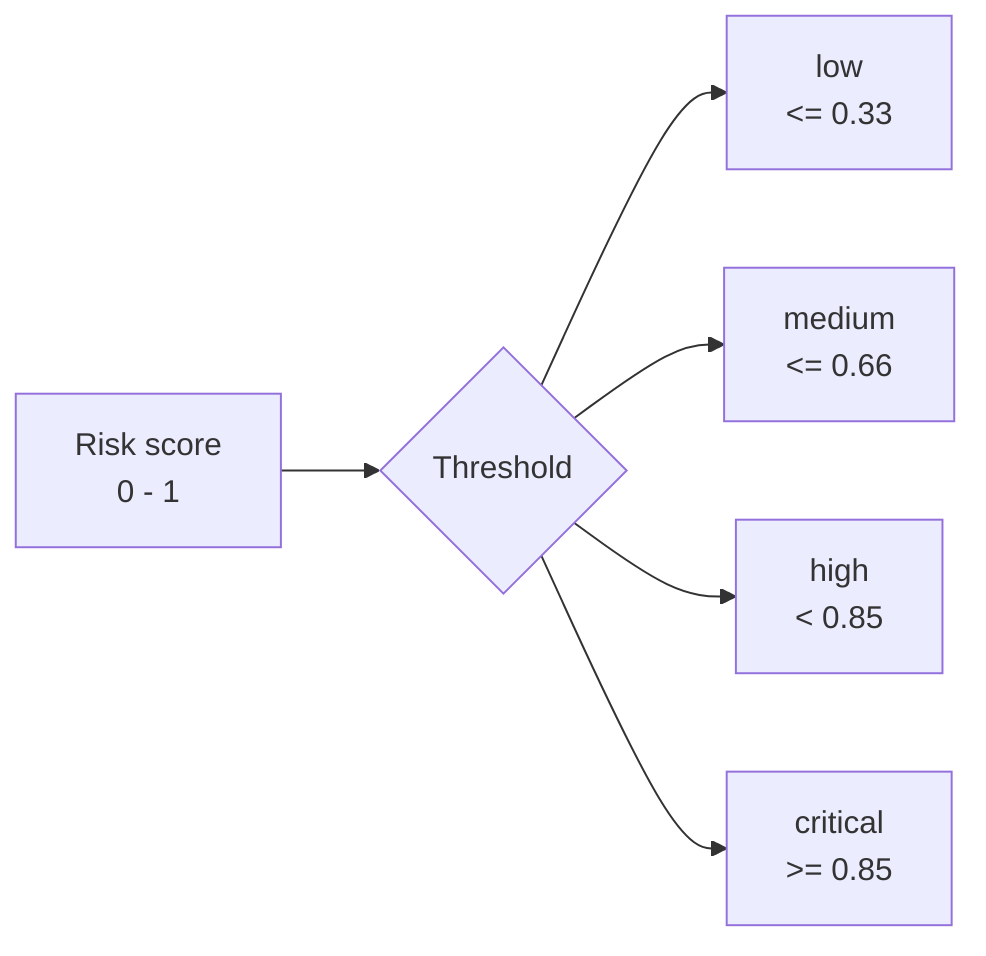

| Risk level | Önerilen aksiyon | Monitoring radius | Alert |
| --- | --- | --- | --- |
| low | routine monitoring | 5 km | yok |
| medium | increase weather review | 10 km | yok |
| high | prioritize local inspection | 20 km | 24 saat |
| critical | immediate supervisor review | 30 km | 12 saat |

**Konuşma notu:**

> Model sadece skor üretir. Skoru kullanıcı için anlamlı yapmak için threshold kullanıyorum. Sonra deterministic rule table aksiyonu seçiyor. Groq veya LLM burada karar vermez. Karar backend kurallarıyla verilir.

---

## 16. LLM / Groq Katmanı

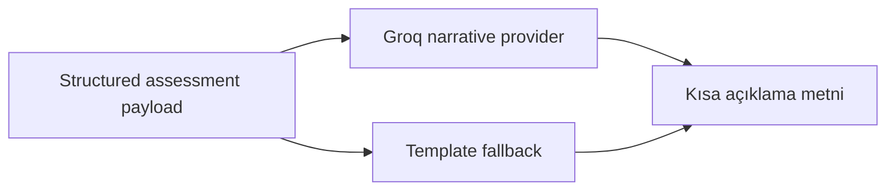

**Önemli nokta:**

LLM risk skorunu üretmez. LLM sadece backend'in ürettiği güvenli ve yapılandırılmış bilgileri basit açıklama metnine çevirir.

**Konuşma notu:**

> LLM katmanı modelin yerine geçmiyor. Risk seviyesi, skor ve öneri önce backend tarafından belirleniyor. Groq sadece bunu görevliye daha anlaşılır metin olarak anlatıyor. Eğer Groq yoksa template fallback var.

---

## 17. Veri Kaynağı Etiketleri ve Güvenilirlik

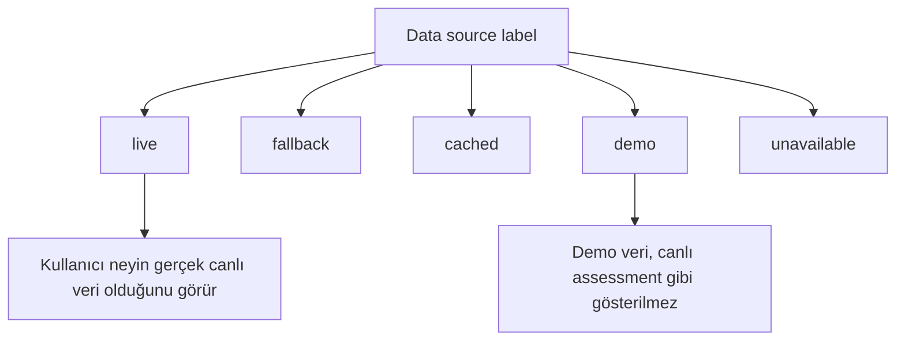

**Konuşma notu:**

> Projede veri kaynağı etiketi çok önemli. Kullanıcı live, demo, fallback veya unavailable durumunu görebilir. Böylece sistem çalışmayan bir entegrasyonu saklamaz ve sahte canlı sonuç üretmez.

---

## 18. Canlı Demo Planı

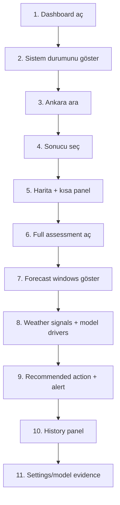

**Canlı demo için kısa cümleler:**

1. "Şimdi dashboard'u açıyorum."
2. "Burada sistemin genel durumu var."
3. "Ankara için arama yapıyorum."
4. "Konumu seçtiğim anda backend assessment API çağrılıyor."
5. "Bu panelde risk seviyesi, skor ve öneri görünüyor."
6. "Full assessment bölümünde now, 24h, 48h ve 72h sonuçlarını görüyoruz."
7. "Burada model inputları ve ayrıca display-only weather signals ayrılmış."
8. "Bu aksiyon LLM tarafından değil, backend rule table tarafından seçiliyor."
9. "Sonuç history içine kaydediliyor."
10. "Settings içinde model, veri kaynağı ve limitation bilgilerini gösteriyorum."

---

## 19. Demo Sırasında Söylenecek Ana Cümle

**Türkçe basit anlatım:**

> Bu sistemde kullanıcı bir Türkiye konumu seçiyor. Frontend bu konumu backend'e gönderiyor. Backend Open-Meteo'dan canlı hava verisini alıyor. Hava verisi model için doğru birimlere çevriliyor. Model risk skorunu hesaplıyor. Sonra backend bu skoru low, medium, high veya critical seviyesine çeviriyor. Sistem önerilen aksiyonu, izleme yarıçapını, uyarı durumunu ve kısa açıklamayı dashboard'da gösteriyor.

**Kısa versiyon:**

> Konum seç, hava verisini al, modeli çalıştır, riski sınıflandır, görevliye karar desteği göster.

---

## 20. Jüri Sorarsa: En Güçlü Taraf Ne?

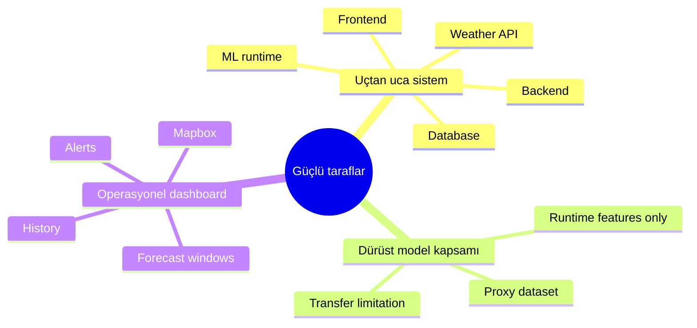

**Cevap:**

> En güçlü tarafı, sadece notebook modeli olmaması. Model gerçek backend içinde çalışıyor. Frontend, API, hava entegrasyonu, persistence, uyarılar ve açıklama katmanı birlikte uçtan uca çalışıyor.

---

## 21. Jüri Sorarsa: En Büyük Limitasyon Ne?

**Cevap:**

> En büyük limitasyon Türkiye için etiketli ve güvenilir wildfire outcome dataset eksikliği. Bu yüzden Fas veri seti proxy olarak kullanıldı. Sonuçlar resmi Türkiye doğruluğu değildir. Operasyonel kullanım için Türkiye yangın kayıtları ile tekrar eğitim ve validasyon gerekir.

**Daha kısa cevap:**

> Model çalışıyor, ama Türkiye için resmi doğruluk iddiası yapmıyorum. Çünkü eğitim verisi Türkiye verisi değil.

---

## 22. Jüri Sorarsa: Neden Bu Teknolojiler?

| Teknoloji | Neden seçildi? |
| --- | --- |
| React + TypeScript | Harita ve panel tabanlı interaktif dashboard için |
| Vite | Hızlı frontend geliştirme |
| Mapbox GL JS | Türkiye merkezli interaktif harita için |
| FastAPI | Python ML modeli ile kolay backend entegrasyonu |
| scikit-learn + joblib | Model eğitimi ve runtime model artifact için |
| Open-Meteo | API key gerektirmeyen hava verisi için |
| OpenWeather | Hava servisi fallback için |
| Groq | Kısa açıklama metni üretmek için |
| SQLite | MVP için basit persistence |

**Konuşma notu:**

> Teknoloji seçimlerimi entegrasyon kolaylığına göre yaptım. Python backend ML modeliyle doğal çalışıyor. React ve Mapbox harita merkezli dashboard için uygun. SQLite final-year MVP için yeterli, ama production için PostgreSQL daha doğru olur.

---

## 23. Kapanış

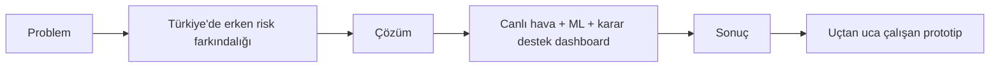

**Kapanış cümlesi:**

> FIREWATCH DSS, orman yangını riskini aktif yangın tespiti olarak değil, erken karar desteği olarak ele alır. Proje canlı hava verisi, makine öğrenmesi, backend kuralları ve harita tabanlı frontend'i birleştirerek uçtan uca çalışan bir prototip sunar.

---

## 24. 1 Dakikalık Özet

> Projemin adı FIREWATCH DSS. Türkiye için hava verisine dayalı orman yangını risk karar destek sistemidir. Kullanıcı haritadan veya aramadan konum seçer. Backend Open-Meteo'dan canlı hava verisini alır. Veriler normalize edilir ve 6 runtime feature ile makine öğrenmesi modeli çalışır. Model risk skoru üretir. Backend bu skoru low, medium, high veya critical seviyesine çevirir. Sonra önerilen aksiyon, izleme yarıçapı, forecast sonuçları, history ve alert bilgisi frontend'de gösterilir. Model Fas wildfire dataset'i ile eğitildiği için sonuçlar Türkiye için resmi doğruluk değildir. Bu proje bir aktif yangın tespit sistemi değil, dürüst kapsamlı bir karar destek prototipidir.

