# FIREWATCH DSS - Türkçe Sunum

---

## 1. Başlık

# FIREWATCH DSS

## Türkiye için hava verisine dayalı orman yangını risk karar destek sistemi

**Kısa tanım:**

FIREWATCH DSS, seçilen bir Türkiye konumu için canlı hava verisini alır, makine öğrenmesi modeli ile göreli yangın riskini hesaplar ve görevliye karar desteği verir.

---

## 2. Proje Ne Yapıyor?

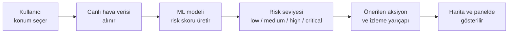

**Ana fikir:**

- Kullanıcı Türkiye'de bir konum seçer.
- Sistem canlı hava ve tahmin verisi alır.
- Model yangın için uygun hava koşullarını değerlendirir.
- Sonuç harita, panel, geçmiş kayıt ve uyarı olarak gösterilir.

---

## 3. Bu Proje Ne Değildir?

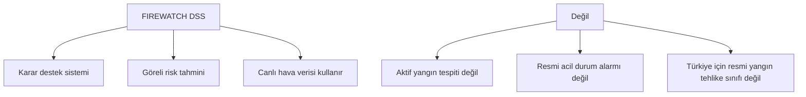

**Önemli sınır:**

Bu proje **relative wildfire risk** verir. Yani "bu hava koşullarında risk daha düşük mü, daha yüksek mi?" sorusuna cevap verir.

---

## 4. Kullanıcılar

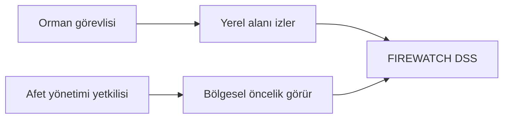

**İki ana kullanıcı:**

- Orman görevlisi: yerel risk ve önerilen aksiyon.
- Afet yönetimi yetkilisi: bölgesel öncelik ve izleme.

---

## 5. Genel Mimari

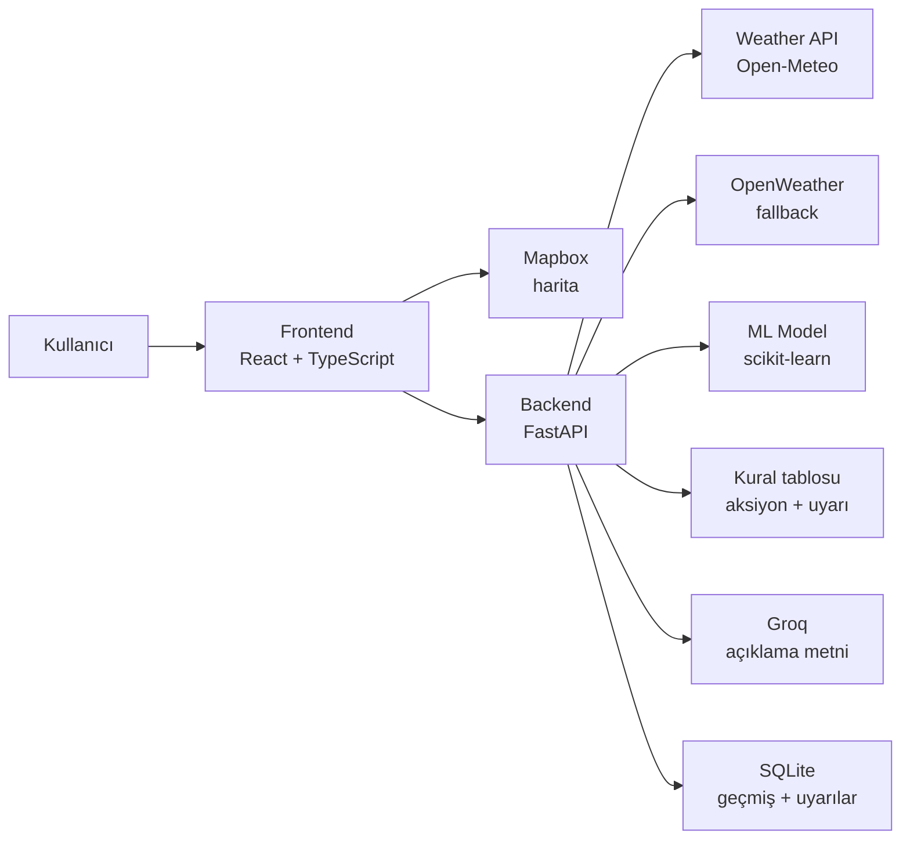

**Tek cümle:**

Frontend sadece gösterir ve kullanıcı etkileşimini yönetir. Backend ise risk kararının ana kaynağıdır.

---

## 6. Canlı Değerlendirme Akışı

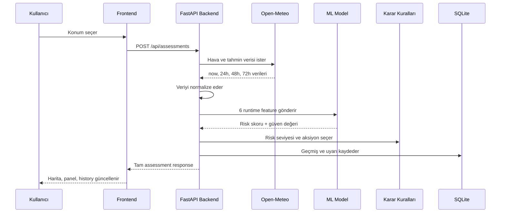

---

## 7. Frontend Nasıl Çalışıyor?

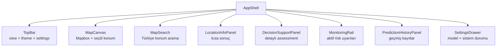

**Frontend görevi:**

- Harita merkezli dashboard.
- Konum arama ve haritadan konum seçme.
- Risk paneli, uyarılar, geçmiş ve sistem durumu.
- Dark/light tema.
- Model algoritması seçme desteği.

---

## 8. Backend Nasıl Çalışıyor?

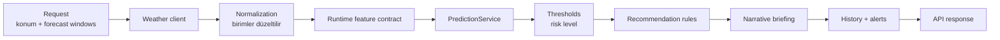

**Backend sorumlulukları:**

- Hava verisi almak.
- Birimleri standart hale getirmek.
- Model girişlerini doğrulamak.
- Risk seviyesini ve öneriyi üretmek.
- Uyarı ve geçmiş kayıtlarını tutmak.
- Servis bozulursa bunu açıkça göstermek.

---

## 9. Hava Verisi ve Forecast Window

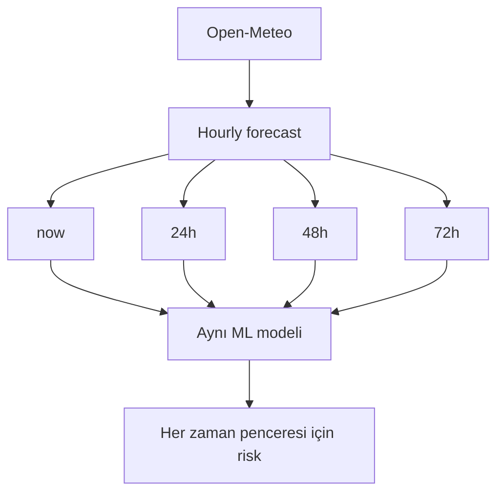

**Kullanılan kaynak:**

- Varsayılan: Open-Meteo.
- Fallback: OpenWeather, API key varsa.
- Hava kaynakları yangın olayı kaynağı değildir.

---

## 10. Model Feature Contract

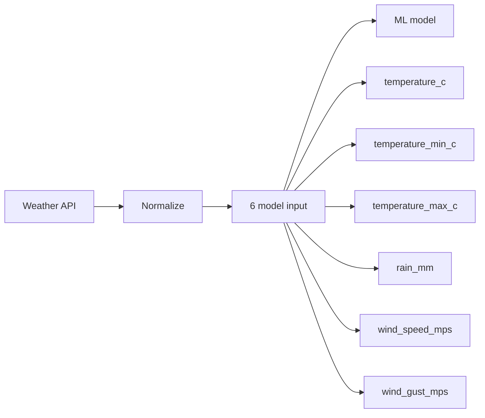

| Feature | Birim | Neden kullanılıyor? |
| --- | --- | --- |
| temperature_c | C | Sıcaklık riski etkiler |
| temperature_min_c | C | Günlük düşük sıcaklık |
| temperature_max_c | C | Günlük yüksek sıcaklık |
| rain_mm | mm | Yağış riski düşürebilir |
| wind_speed_mps | m/s | Rüzgar yayılmayı etkiler |
| wind_gust_mps | m/s | Ani rüzgar riski artırabilir |

---

## 11. ML Eğitim Süreci

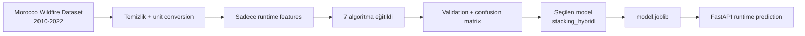

**Dataset:**

- Morocco Wildfire Dataset, 2010-2022.
- Türkiye verisi olmadığı için proxy dataset kullanıldı.
- Sonuçlar Türkiye için resmi doğruluk değildir.

---

## 12. Kaç Algoritma Kullandım?

**Toplam 7 algoritma / model adayı test edildi:**

| Algoritma | Rol |
| --- | --- |
| Logistic Regression | Basit baseline |
| Random Forest | Ağaç tabanlı güçlü model |
| Extra Trees | Daha rastgele ağaç ensemble |
| Gradient Boosting | Boosting tabanlı model |
| XGBoost | Güçlü boosting adayı |
| Soft Voting Hybrid | Birden çok modelin oylaması |
| Stacking Hybrid | Seçilen serving model |

---

## 13. Model Performansı

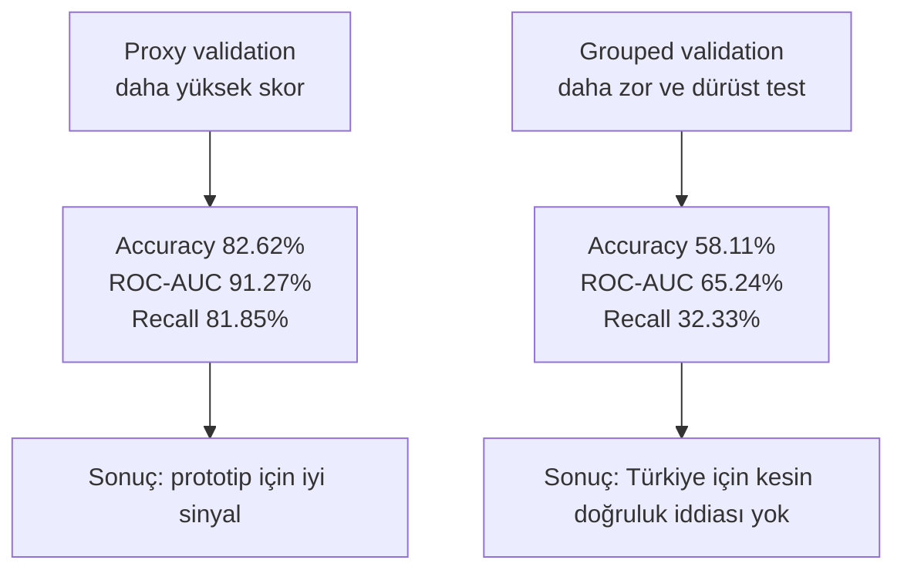

**Seçilen model: `stacking_hybrid`**

| Metrik | Normal proxy validation | Grouped validation |
| --- | ---: | ---: |
| Accuracy | 82.62% | 58.11% |
| ROC-AUC | 91.27% | 65.24% |
| Wildfire precision | 83.06% | 66.79% |
| Wildfire recall | 81.85% | 32.33% |
| Wildfire F1 | 82.45% | 43.57% |

---

## 14. Neden Daha Yüksek Performans Alamadım?

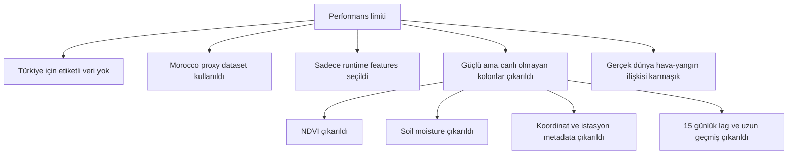

**Basit açıklama:**

Modeli daha yüksek göstermek mümkündü, ama bu doğru olmazdı. Çünkü bazı güçlü kolonlar canlı Türkiye kullanımında yoktu.

---

## 15. Risk Skoru Nasıl Karara Dönüşüyor?

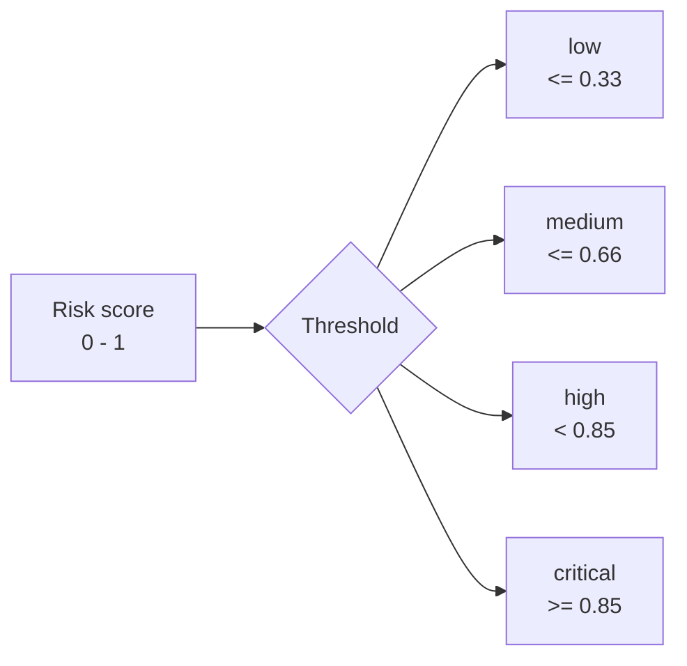

| Risk level | Önerilen aksiyon | Monitoring radius | Alert |
| --- | --- | --- | --- |
| low | routine monitoring | 5 km | yok |
| medium | increase weather review | 10 km | yok |
| high | prioritize local inspection | 20 km | 24 saat |
| critical | immediate supervisor review | 30 km | 12 saat |

---

## 16. LLM / Groq Katmanı

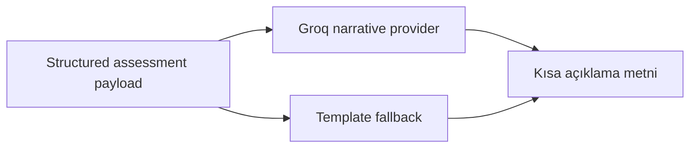

**Önemli nokta:**

LLM risk skorunu üretmez. LLM sadece backend'in ürettiği güvenli ve yapılandırılmış bilgileri basit açıklama metnine çevirir.

---

## 17. Veri Kaynağı Etiketleri ve Güvenilirlik

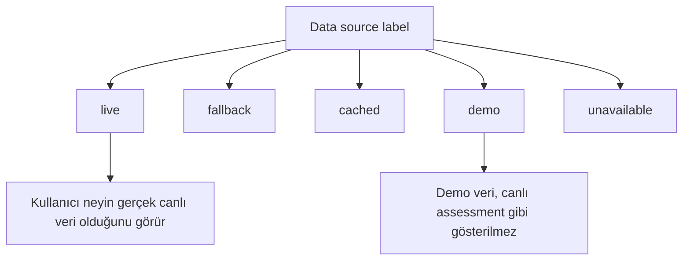

---

## 18. Canlı Demo Planı

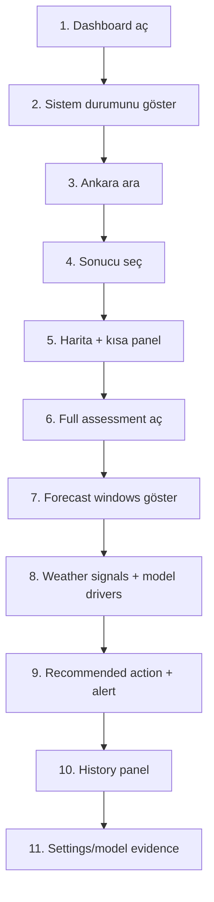

---

## 18A. Kullanıcı Perspektifi: Genel Kullanım

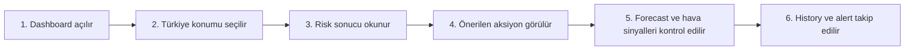

**Kullanıcı ne yapar?**

- Dashboard'u açar.
- Haritadan veya aramadan bir Türkiye konumu seçer.
- Risk seviyesini ve skoru okur.
- Sistem önerisini ve izleme yarıçapını kontrol eder.
- Gerekirse forecast, history ve alert bölümlerine bakar.

---

## 18B. Demo Sırası: Kullanıcı Yolculuğu

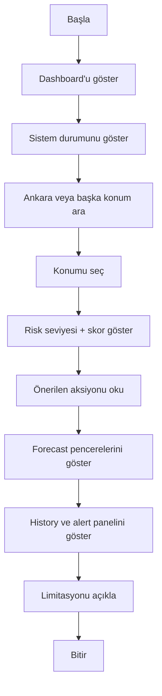

**Demo adımları:**

1. Dashboard'u aç.
2. Sistem durumunu göster.
3. Bir Türkiye konumu ara.
4. Konumu seç ve sonucu bekle.
5. Risk seviyesini, skoru ve öneriyi anlat.
6. Forecast, history ve alert panellerini göster.
7. Sonunda model limitasyonunu açıkça söyle.

---

## 20. En Güçlü Taraf

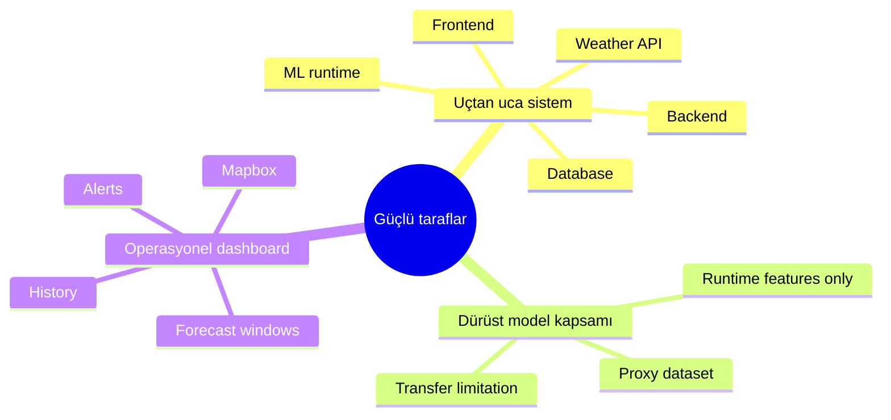

> En güçlü tarafı, sadece notebook modeli olmaması. Model gerçek backend içinde çalışıyor. Frontend, API, hava entegrasyonu, persistence, uyarılar ve açıklama katmanı birlikte uçtan uca çalışıyor.

---

## 21. En Büyük Limitasyon

> En büyük limitasyon Türkiye için etiketli ve güvenilir wildfire outcome dataset eksikliği. Bu yüzden Fas veri seti proxy olarak kullanıldı. Sonuçlar resmi Türkiye doğruluğu değildir. Operasyonel kullanım için Türkiye yangın kayıtları ile tekrar eğitim ve validasyon gerekir.

---

## 22. Teknoloji Seçimi

| Teknoloji | Neden seçildi? |
| --- | --- |
| React + TypeScript | Harita ve panel tabanlı interaktif dashboard için |
| Vite | Hızlı frontend geliştirme |
| Mapbox GL JS | Türkiye merkezli interaktif harita için |
| FastAPI | Python ML modeli ile kolay backend entegrasyonu |
| scikit-learn + joblib | Model eğitimi ve runtime model artifact için |
| Open-Meteo | API key gerektirmeyen hava verisi için |
| OpenWeather | Hava servisi fallback için |
| Groq | Kısa açıklama metni üretmek için |
| SQLite | MVP için basit persistence |

---

## 23. Kapanış

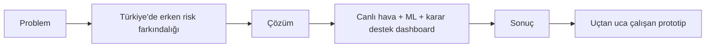

> FIREWATCH DSS, orman yangını riskini aktif yangın tespiti olarak değil, erken karar desteği olarak ele alır. Proje canlı hava verisi, makine öğrenmesi, backend kuralları ve harita tabanlı frontend'i birleştirerek uçtan uca çalışan bir prototip sunar.

---

## 24. 1 Dakikalık Özet

> Projemin adı FIREWATCH DSS. Türkiye için hava verisine dayalı orman yangını risk karar destek sistemidir. Kullanıcı haritadan veya aramadan konum seçer. Backend Open-Meteo'dan canlı hava verisini alır. Veriler normalize edilir ve 6 runtime feature ile makine öğrenmesi modeli çalışır. Model risk skoru üretir. Backend bu skoru low, medium, high veya critical seviyesine çevirir. Sonra önerilen aksiyon, izleme yarıçapı, forecast sonuçları, history ve alert bilgisi frontend'de gösterilir. Model Fas wildfire dataset'i ile eğitildiği için sonuçlar Türkiye için resmi doğruluk değildir. Bu proje bir aktif yangın tespit sistemi değil, dürüst kapsamlı bir karar destek prototipidir.

